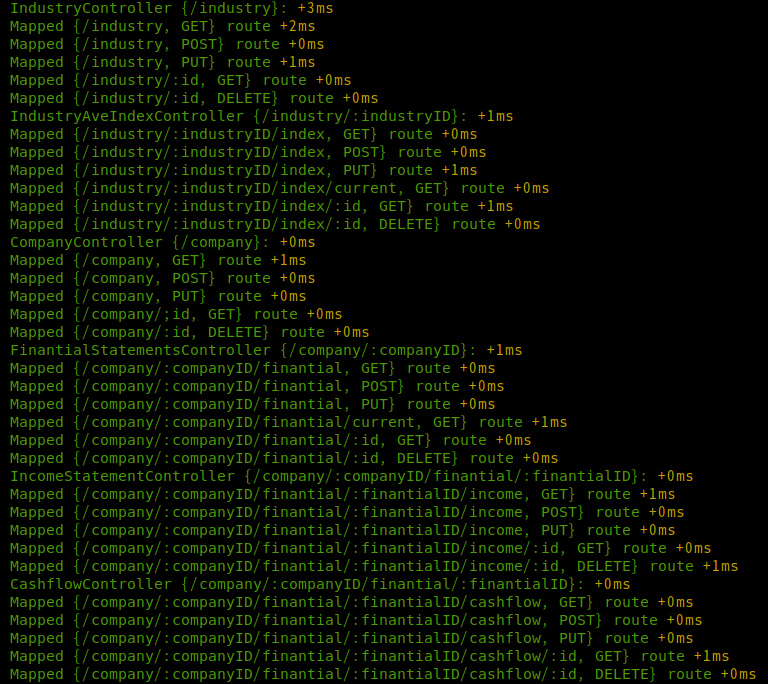

# toko

株式売買をする上で、過去のデータを収集して判断材料にする web アプリケーションのバックエンド予定地です.
REST API で構成しています.

## Routing



## ディレクトリ構造

```
.
├── .husky # commit or push時に実行する設定の管理
├── .vscode # vscodeを使う際の設定
├── docs # READMEに掲載している画像置き場
├── mock
│    ├─ package.json # mock serverの起動に必要なパッケージの管理
│    └─ swagger.yaml # mock serverの構成が記述されている
├── src
│    ├─ balance-sheet # 貸借対照表周りの実装
│    │    │
│    │    ├─ **.service.ts # DBを叩く部分の実装
│    │    ├─ **.service.ts # DBを叩く部分の実装
│    │    ├─ **.service.spec.ts # DBを叩く部分のテスト
│    │    ├─ **.controller.ts # requestに対して処理を実施する箇所
│    │    ├─ **.module.ts # Nest.jsやTypeormの設定が記述されている
│    │    └─ type.ts # io-tsを用いた引数の型検査を実施
│    │
│    ├─ cashflow # キャッシュ・フロー計算書周りの実装
│    ├─ company # 企業周りの実装
│    ├─ balance-sheet # 貸借対照表周りの実装
│    ├─ finantial-statements # 財務諸表周りの実装
│    ├─ income-statement # 損益計算書周りの実装
│    ├─ index # 指標周りの実装
│    ├─ industry-ave-index # 業種毎の平均指標周りの実装
│    ├─ industry # 業種周りの実装
│    ├─ entities
│    │    └─ **.entity.ts # **のエンティティクラスを実装
│    ├─ utils
│    │    ├─ generateTestingModule.ts # TestingModuleの生成を担う
│    │    ├─ printException.ts # fp-ts/pipeの途中にログ出力したい時に使う
│    │    ├─ returnWithThrowHttpException.ts # Controllerにて例外をいい感じにする
│    │    ├─ validateIdentify.ts # DBの操作結果からidを抽出する
│    │    └─ validateWithTaskEither.ts # requestに付随するパラメーターの型検査を実施
│    ├─ app.module.ts # Nest.jsやTypeormの設定が記述されている
│    └─ main.ts # Nest.jsの設定が記述されている
├── test # e2eテスト置き場(未実装)
├── docker-compose.yml # mysqlを用いたDBの設定の管理
├── nest-cli.json # Nest.jsの設定の管理
├── .env # 環境変数置き場
└── ormconfig.json # Nest.jsの設定の管理
```

## 導入

```bash
$ yarn

# mock serverを起動する場合
$ cd mock
$ yarn

$ cp .env.sample .env
# 環境変数を書き込む
$ vim .env
```

## 開発

```bash
# mysqlを裏で起動しておく
$ docker-compose up -d

# development
$ yarn start:dev

# production mode
$ yarn start:prod

# mock server
# mock serverの起動をやる場合はmysqlの起動は必要なし
$ yarn dev
```

## Test

```bash
# unit tests
$ yarn test

# e2e tests
$ yarn test:e2e

# test coverage
$ yarn test:cov
```

## 技術スタック

mock server は`Swagger`を用いて実装してます。
`mock/swagger.yaml`は Stoplight Studio を用いて作成し、起動は Prism を使ってます。

本体の方は`Nest.js`をメインに色々やってます。
